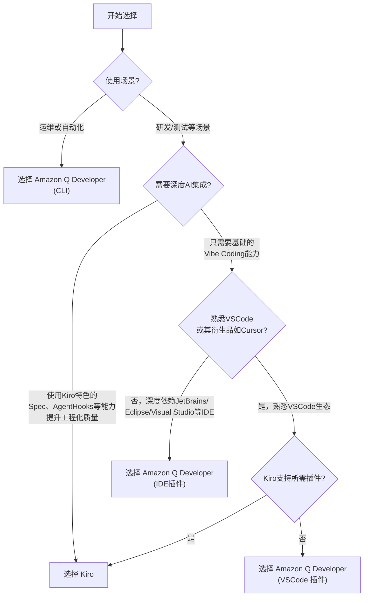

# Amazon Q Developer 用户常见问题

本常见问题作为官方 [Kiro FAQ](https://kiro.dev/faq/) 的补充指南，专门针对 Amazon Q Developer 用户。

{}
**注意**：目前 Kiro 正在预览期，快速发展中，信息可能不是最新的。
{}

## 一般问题

**问：什么是 Kiro，Kiro 与 Amazon Q Developer 有什么区别？**

**Kiro** 是一个具有高级 AI 功能和增强用户体验的 Agentic IDE（集成开发环境）。**Amazon Q Developer** 与您现有的 IDE（如 Visual Studio Code、JetBrains、Eclipse、Visual Studio）和终端集成。

主要区别：

- Kiro 是一个专为 AI 辅助开发而从头构建的独立 IDE
- Amazon Q Developer 作为插件/扩展在现有开发环境中工作

**问：我该如何选择 Kiro 与 Amazon Q Developer？**

Kiro 和 Amazon Q Developer 并不冲突，在不同的场景解决了不同的问题。您可以根据需求，参考如下决策树，来判断是否选择 Kiro，Amazon Q Developer，或二者都有。

**问：我是 Amazon Q Developer Pro 用户。免费期结束后我还能使用 Kiro 吗？**

在免费期结束后，需要选择订阅 Kiro 付费版本或保持 Free Tier （50 次 Vibe 每月）。

## 通过 Amazon Q Developer Pro 订阅使用

{}
**注意**：Kiro 和 Amazon Q Developer 为两个独立的产品。预览期间，目前开发者可以通过 Q Developer Pro 账号登陆体验 Kiro。 等 Kiro 发布后，产品上可能会有调整，敬请关注。
{}

**问：如何使用我的 Amazon Q Developer Pro 账户登录 Kiro？**

按照以下步骤使用您的 Amazon Q Developer Pro 账户登录：

1. 在登录页面上，选择**Sign in with your organization identity**。

2. 在使用 AWS Identity Center 登录页面上：

   - 输入起始 URL（例如，`xxxx.awsapps.com/start`）
   - 选择配置您的 AWS Identity Center 的 AWS 区域（例如，`us-east-1`）

3. 选择**Continue**并按照屏幕上的说明完成身份验证过程。

下方视频教程：

<iframe src="//player.bilibili.com/player.html?isOutside=true&aid=114880124289102&bvid=BV1MMuoz2E5e&cid=31151491993&p=1&autoplay=0" scrolling="no" border="0" frameborder="no" framespacing="0" allowfullscreen="true" style="width: 100%; height: 500px;"></iframe>
